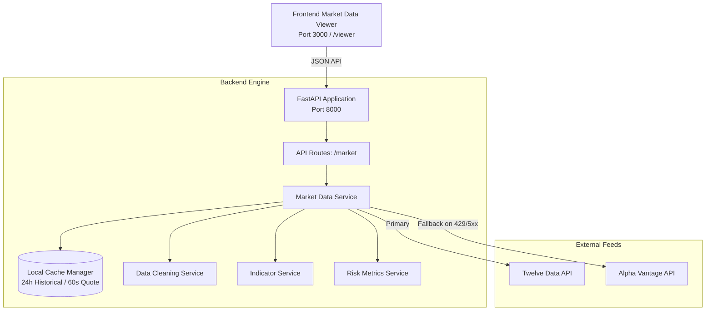

# Quantexa: Multi-Asset Quantitative Financial Intelligence Platform

[](https://www.python.org/downloads/)
[](https://fastapi.tiangolo.com/)
[](https://docs.pydantic.dev/)
[](#testing-instructions)
[](#current-project-status)

---

## 1. Project Title

**Quantexa** — Multi-Asset Quantitative Financial Intelligence & Analytics Engine

---

## 2. Short Project Description

**Quantexa** is an enterprise-grade quantitative market data analysis platform designed to ingest, validate, and process heterogeneous multi-asset time series in real time. Combining high-availability data feeds (Twelve Data primary with automated Alpha Vantage fallback), an automated data-cleaning pipeline, and causal mathematical indicator engines, Quantexa provides systematic financial models with verifiable, clean market data.

---

## 3. Problem Being Solved

Algorithmic trading systems and quantitative risk models frequently fail in production due to three critical data engineering vulnerabilities:
1. **Upstream Feed Unreliability**: Single-provider API outages, restrictive rate limits, and schema discrepancies interrupt analytical pipelines.
2. **Dirty Historical Data**: Unhandled duplicate timestamps, out-of-sequence records, non-numeric price anomalies, and impossible OHLC relationships (e.g., $Low > High$) corrupt algorithmic signals.
3. **Look-Ahead Bias**: Improperly windowed moving averages and volatility estimates accidentally incorporate future price discovery into past signals, inflating theoretical backtest performance.

**Quantexa solves these challenges** by delivering:
- A **dual-provider failover ingestion architecture** with local disk caching.
- An **automated data cleaning pipeline** that enforces chronological order, UTC ISO-8601 normalization, and financial invariants.
- **Strictly causal quantitative engines** computing moving averages, returns, and rolling volatility with zero look-ahead bias.

---

## 4. Supported Multi-Asset Universe

Quantexa provides unified data models and analytics across three distinct asset classes:

| Asset | Ticker / Symbol | Asset Class | Data Nature & Volume Semantics |
| :--- | :--- | :--- | :--- |
| **NVIDIA Corporation** | `NVDA` | Equity | Continuous daily bars with full trade share volume |
| **Bitcoin USD** | `BTC/USD` | Cryptocurrency | 24/7 global spot market; volume is legitimately `null` |
| **Gold Spot Bullion** | `XAU/USD` | Commodity / Forex | OTC physical spot rate; volume is legitimately `null` |

---

## 5. Current Quantitative Capabilities

The platform currently provides institutional-grade mathematical models implemented with zero look-ahead bias:

### Simple Moving Average (SMA)
Calculates the unweighted rolling arithmetic mean over a configurable lookback window $n \ge 1$:
$$\text{SMA}_t(n) = \frac{1}{n} \sum_{k=0}^{n-1} P_{t-k}$$

### Exponential Moving Average (EMA)
Calculates an exponentially weighted moving average using an institutional SMA seed for the first $n$ observations and smoothing multiplier $\alpha = \frac{2}{n+1}$:
$$\text{EMA}_t = \alpha \cdot P_t + (1 - \alpha) \cdot \text{EMA}_{t-1}$$

### Daily Percentage Returns
Measures close-to-close percentage relative price discovery across trading days:
$$R_t = \left( \frac{P_t - P_{t-1}}{P_{t-1}} \right) \times 100\%$$

### Rolling Volatility
Estimates historical risk via the sample standard deviation of daily returns using Bessel's correction ($ddof = 1$):
$$\sigma_t(n) = \sqrt{\frac{1}{n - 1} \sum_{i=0}^{n-1} \left( R_{t-i} - \bar{R}_t \right)^2}$$

*(Note: Rolling volatility is non-annualized daily percentage volatility).*

### Annualized Sharpe Ratio
Measures risk-adjusted excess returns over an annualized risk-free rate benchmark:
$$\text{Sharpe} = \left( \frac{\bar{R} - \frac{R_f}{N}}{\sigma} \right) \times \sqrt{N}$$

### Maximum Drawdown (MDD)
Tracks running peak price discovery and computes maximum historical peak-to-trough decline with exact trough timestamp identification:
$$\text{Peak}_t = \max_{0 \le i \le t}(P_i), \quad \text{Drawdown}_t = \left( \frac{P_t}{\text{Peak}_t} - 1 \right) \times 100\%$$

### Multi-Asset Pearson Correlation
Computes pairwise symmetric Pearson correlation matrices strictly across aligned daily returns with unit diagonal:
$$r_{xy} = \frac{\sum_{i=1}^n (X_i - \bar{X})(Y_i - \bar{Y})}{\sqrt{\sum_{i=1}^n (X_i - \bar{X})^2 \cdot \sum_{i=1}^n (Y_i - \bar{Y})^2}}$$

### Rolling Correlation
Computes dynamic causal co-movement across rolling windows ($W \ge 2$) with strict initial $W - 1$ warmup preservation.

---

## 6. Technology Stack

- **Backend Framework**: [FastAPI](https://fastapi.tiangolo.com/) (Asynchronous Python 3.11+)
- **Data Validation & Schemas**: [Pydantic v2](https://docs.pydantic.dev/) & `pydantic-settings`
- **Numerical Processing**: [Pandas](https://pandas.pydata.org/) & Python Standard Math Library
- **HTTP Client**: [HTTPX](https://www.python-httpx.org/) (Asynchronous, connection-pooled)
- **Automated Testing**: [Pytest](https://docs.pytest.org/) & `pytest-asyncio`
- **Frontend / Viewer**: Vanilla JavaScript (ES6+), HTML5, CSS3, Tailwind CSS (CDN), Lucide Icons
- **Market Data Feeds**: [Twelve Data API](https://twelvedata.com/) (Primary) + [Alpha Vantage](https://www.alphavantage.co/) (Fallback)

---

## 7. Architecture Overview



For comprehensive architectural design, see [`docs/architecture.md`](docs/architecture.md).

---

## 8. Backend Setup

### Prerequisites
- Python 3.11 or higher
- Git

### Installation Steps

1. **Clone the repository:**
   ```bash
   git clone <repo-url>
   cd quantexa
   ```

2. **Create and activate a virtual environment:**
   ```bash
   # Windows
   python -m venv .venv
   .\.venv\Scripts\activate

   # macOS / Linux
   python3 -m venv .venv
   source .venv/bin/activate
   ```

3. **Install dependencies:**
   ```bash
   pip install -r backend/requirements.txt
   ```

4. **Launch the backend server:**
   ```bash
   cd backend
   uvicorn app.main:app --host 127.0.0.1 --port 8000 --reload
   ```

The interactive OpenAPI documentation will be accessible at:
- **Swagger UI**: `http://127.0.0.1:8000/docs`
- **ReDoc**: `http://127.0.0.1:8000/redoc`

---

## 9. Frontend Setup

The frontend is a zero-build, responsive single-page Market Data Ingestion Viewer.

### Running with Python HTTP Server:
```bash
# From the repository root
python -m http.server 3000 --directory frontend
```

Open your browser to:
```
http://localhost:3000
```
*(Alternatively, navigate to `http://127.0.0.1:8000/viewer` which serves the interface directly through FastAPI).*

---

## 10. Environment Variable Configuration

Create a `.env` file in `backend/.env` (or project root):

```ini
# Server Configuration
ENVIRONMENT=development
LOG_LEVEL=INFO
PORT=8000
HOST=127.0.0.1

# Market Data Providers
PRIMARY_PROVIDER=twelve_data
FALLBACK_PROVIDER=alpha_vantage

# Twelve Data API (Primary)
TWELVE_DATA_API_KEY=your_twelve_data_api_key_here

# Alpha Vantage API (Fallback)
ALPHA_VANTAGE_API_KEY=your_alpha_vantage_api_key_here

# Cache Settings
HISTORICAL_CACHE_TTL_HOURS=24
LATEST_CACHE_TTL_SECONDS=60
```

> [!TIP]
> A ready-to-use template is available at [`backend/.env.example`](backend/.env.example). Never commit your `.env` file to source control.

---

## 11. API Endpoint Overview

| Method | Endpoint | Query Parameters | Description |
| :--- | :--- | :--- | :--- |
| `GET` | `/health` | — | System health, active providers, masked keys, cache stats |
| `GET` | `/assets` | — | Lists supported assets (`NVDA`, `BTC/USD`, `XAU/USD`) |
| `GET` | `/market/{asset}/historical` | `outputsize`, `refresh` | Normalized raw daily price history |
| `GET` | `/market/{asset}/latest` | `refresh` | Latest available price quote |
| `GET` | `/market/{asset}/data` | `refresh` | Clean, deduplicated, chronologically sorted dataset |
| `GET` | `/market/{asset}/data/summary` | `refresh` | Executive data hygiene and completeness report |
| `GET` | `/market/{asset}/indicators` | `sma_period`, `ema_period`, `refresh` | SMA and EMA technical indicators |
| `GET` | `/market/{asset}/risk-metrics` | `volatility_period`, `refresh` | Daily percentage returns & rolling volatility ($ddof=1$) |
| `GET` | `/market/{asset}/risk-analysis` | `risk_free_rate`, `annualization_factor`, `refresh` | Annualized Sharpe ratio & running peak Maximum Drawdown |
| `GET` | `/market/correlation` | `refresh` | Pairwise symmetric Pearson correlation matrix across multi-asset returns |
| `GET` | `/market/correlation/rolling` | `window`, `asset1`, `asset2`, `refresh` | Configurable rolling Pearson correlation time series across asset pairs |

For complete schemas and examples, see [`docs/api.md`](docs/api.md).

---

## 12. Testing Instructions

The repository includes a comprehensive automated test suite covering unit logic, integration failovers, data cleaning boundaries, mathematical properties, and route contracts.

### Run All Automated Tests:
```bash
pytest backend/tests -v
```

### Test Suite Summary:
- `backend/tests/test_api.py` — API routes and health checks (7 tests)
- `backend/tests/test_normalization.py` — Normalization and provider edge cases (8 tests)
- `backend/tests/test_twelve_data.py` & `test_twelve_data_integration.py` — Failover, caching, rate-limit resilience (7 tests)
- `backend/tests/test_data_cleaner.py` — Deduplication, sorting, OHLC boundaries (8 tests)
- `backend/tests/test_indicators.py` — SMA, EMA, period validation, look-ahead protection (11 tests)
- `backend/tests/test_risk_metrics.py` — Daily returns, rolling volatility, Bessel's correction (12 tests)
- `backend/tests/test_risk_analysis.py` — Sharpe Ratio, Maximum Drawdown, running peak, error handling (12 tests)
- `backend/tests/test_correlation.py` — Pearson matrix, date alignment, rolling series, HTTP 400 validation (19 tests)

**Total: 84 automated tests (100% passing)**.

---

## 13. Current Project Status

| Milestone | Status | Description |
| :--- | :---: | :--- |
| **Step 1: Market Data Ingestion** | **COMPLETE** | Live multi-asset data feeds with UTC ISO normalization |
| **Step 2: Fallback & Caching** | **COMPLETE** | Twelve Data primary + Alpha Vantage fallback + disk cache |
| **Step 3: Data Cleaning** | **COMPLETE** | Timestamp deduplication, chronological sorting, OHLC validation |
| **Step 4: SMA & EMA Indicators** | **COMPLETE** | Mathematical moving averages with zero look-ahead bias |
| **Step 5: Returns & Volatility** | **COMPLETE** | Percentage returns and rolling sample volatility ($ddof=1$) |
| **Step 5.5: Structure Reorganization** | **COMPLETE** | Professional hackathon repository layout & documentation |
| **Step 6: Sharpe Ratio & Drawdown** | **COMPLETE** | Annualized Sharpe Ratio and running peak Maximum Drawdown |
| **Step 7: Correlation & Rolling Correlation** | **COMPLETE** | Multi-asset Pearson correlation matrix and rolling correlation series |
| **Step 8+: Systematic Backtesting** | **NOT STARTED** | Reserved for subsequent milestone |


---

## Project Documentation

Detailed technical documents are maintained in [`docs/`](docs/):
- **Architecture**: [`docs/architecture.md`](docs/architecture.md)
- **API Reference**: [`docs/api.md`](docs/api.md)
- **Quantitative Methodology**: [`docs/quantitative-methodology.md`](docs/quantitative-methodology.md)
- **Development Progress**: [`docs/development-progress.md`](docs/development-progress.md)
- **Agent Operating Guidelines**: [`AGENTS.md`](AGENTS.md)
