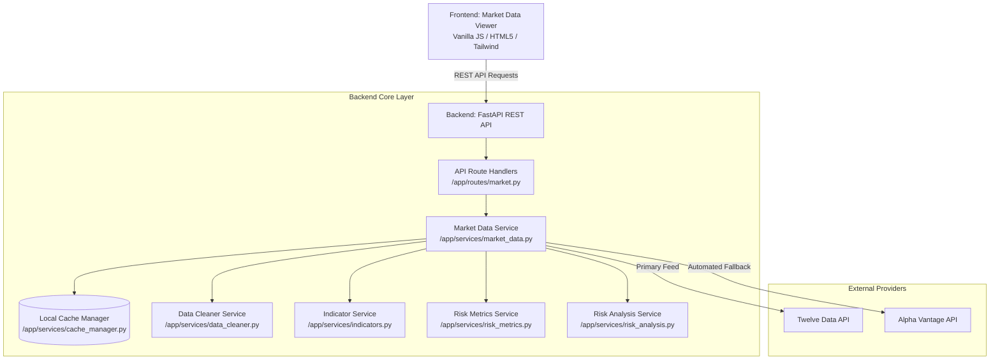
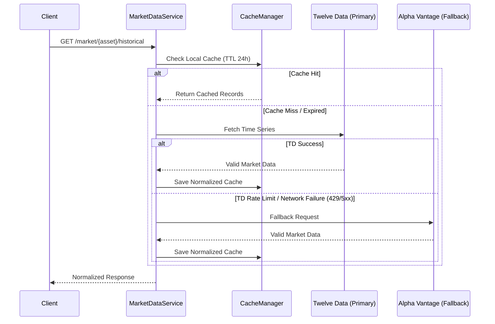
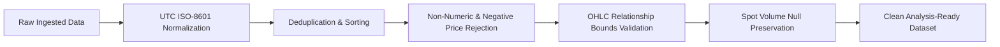

# System Architecture

## Overview

The **Quantexa** platform is a high-performance quantitative financial intelligence and analytics engine designed to ingest, clean, and analyze multi-asset market data in real time. It serves as the foundation for systematic trading strategies and risk evaluation.

---

## Architectural Components

### 1. Frontend: Market Data Viewer

- **Technology**: Vanilla HTML5, CSS3, JavaScript (ES6+), Tailwind CSS (CDN), Lucide Icons.
- **Location**: `frontend/index.html` (served on port `3000` or via backend route `/viewer`).
- **Functionality**:
  - Real-time asset switching across NVIDIA (`NVDA`), Bitcoin (`BTC/USD`), and Gold (`XAU/USD`).
  - Interactive inspection of raw historical market data, cleaned datasets, and technical indicators.
  - Quality metrics dashboard showing missing records, duplicates detected, and timestamp health.
  - Zero framework overhead for maximum portability and rapid loading in hackathon evaluation environments.

---

### 2. Backend: FastAPI Core Engine

- **Technology**: Python 3.11+, FastAPI, Pydantic v2, HTTPX, Pandas.
- **Location**: `backend/app/`
- **Structure**:
  - `app/main.py`: Application entry point, CORS middleware, lifespan setup, and global exception handlers.
  - `app/config.py`: Centralized configuration via `pydantic-settings`, dynamic `.env` loading, and asset registry.
  - `app/routes/market.py`: Validated REST endpoints for market data, data hygiene, indicators, and risk metrics.
  - `app/models/schemas.py`: Pydantic models enforcing strict contract types and response serialization.
  - `app/utils/`: Custom exception definitions (`app.utils.exceptions`) and structured logging (`app.utils.logging`).

---

### 3. Market-Data Ingestion Layer

The platform implements a resilient, dual-provider architecture to ensure high availability and eliminate single points of failure.

- **Primary Provider — Twelve Data**:
  - Ingests daily price bars (Open, High, Low, Close) and latest quotes.
  - **Equities (`NVDA`)**: Time series with full trading volume.
  - **Cryptocurrencies (`BTC/USD`)**: Spot cryptocurrency series where volume is legitimately `null`.
  - **Commodities / Forex (`XAU/USD`)**: Spot gold bullion series where volume is legitimately `null`.
- **Automated Fallback Provider — Alpha Vantage**:
  - Seamlessly activates when Twelve Data returns HTTP 429 (rate limits), HTTP 5xx, or invalid payloads.
  - Employs normalization adapters to guarantee downstream schema invariance regardless of provider.
- **Provider Integrity Rule**:
  - **Zero Fake Data**: Only authentic external market data is ingested. If both providers fail and no cache exists, the API raises an upstream service error (HTTP 502/504) rather than returning synthetic prices.

---

### 4. Cache Manager

- **Technology**: File-based JSON caching (`app/services/cache_manager.py`).
- **Location**: `backend/data/cache/` (excluded from version control).
- **TTL Strategy**:
  - **Historical Daily Data**: 24-hour TTL (daily bars do not mutate retroactively).
  - **Latest Quotes**: 60-second TTL (balances real-time responsiveness with API quota conservation).
  - **Clean Data & Analytical Caches**: Derived caches invalidate automatically when underlying historical records refresh.
- **Key Features**:
  - Thread-safe atomic file writing.
  - Cache bypass support via `?refresh=true` query parameter.
  - Complete isolation of API credentials; keys are never stored in cache files.

---

### 5. Data Storage & Cleaning Pipeline

Located in `app/services/data_cleaner.py`, this service guarantees strict quantitative integrity before data is fed into mathematical models.

- **Validation & Transformation Steps**:
  1. **UTC Normalization**: Converts all datetime strings to standard ISO-8601 UTC format (`YYYY-MM-DDTHH:MM:SSZ`).
  2. **Timestamp Deduplication**: Detects identical timestamps, retaining only the latest consistent observation.
  3. **Strict Chronological Ordering**: Ensures ascending order ($t_0 < t_1 < \dots < t_N$).
  4. **Invalid Price Rejection**: Drops non-numeric, `NaN`, `null`, zero, or negative price points.
  5. **OHLC Relational Validation**: Enforces financial sanity bounds:
     $$\text{Low} \le \text{Open} \le \text{High} \quad \text{and} \quad \text{Low} \le \text{Close} \le \text{High}$$
  6. **Volume Semantics**: Retains volume for equities, while preserving legitimate `null` volume for spot crypto (`BTC/USD`) and spot bullion (`XAU/USD`).

---

### 6. Quantitative Analysis Pipeline

Built directly on top of the clean historical data layer, ensuring reproducible mathematical computations.

- **Look-Ahead Bias Prevention**:
  All indicator and risk calculations are calculated sequentially in forward chronological time. Value at index $t$ depends exclusively on data available at indices $i \le t$.
- **Indicator Engine (`app/services/indicators.py`)**:
  - **Simple Moving Average (SMA)**: Rolling arithmetic mean over $n$ periods.
  - **Exponential Moving Average (EMA)**: Exponential weighting with an initial seed set to $SMA_n$.
- **Risk Engine (`app/services/risk_metrics.py`)**:
  - **Daily Percentage Returns**: Close-to-close percentage change ($R_t = \frac{P_t - P_{t-1}}{P_{t-1}}$).
  - **Rolling Volatility**: Rolling sample standard deviation of daily returns using Bessel's correction ($ddof=1$).
- **Risk Analysis Engine (`app/services/risk_analysis.py`)**:
  - **Annualized Sharpe Ratio**: Excess return over annualized risk-free rate divided by sample standard deviation ($ddof=1$) scaled by $\sqrt{N}$.
  - **Maximum Drawdown (MDD)**: Continuous running peak tracking ($\text{Peak}_t = \max_{i \le t}(P_i)$) with full drawdown curve and trough date identification.
- **API Endpoints**:
  - Clean Data: `GET /market/{asset}/data`
  - Quality Summary: `GET /market/{asset}/data/summary`
  - Technical Indicators: `GET /market/{asset}/indicators`
  - Quantitative Risk Metrics: `GET /market/{asset}/risk-metrics`
  - Quantitative Risk Analysis: `GET /market/{asset}/risk-analysis`
